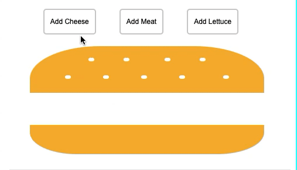

# NgProjection

Simple example of how [Angular Single content Projection](https://angular.io/guide/content-projection) Works!. 

**Definition**: With this type of content projection, a component accepts content from a single source.

We will show the behavior of this angular characteristic, by using a "burger scenario" in which we have to add some ingredients to our burger in a dynamic way, this can help us to create reusable components in our apps. 🙂

1. Defining Parent [burger.component.html]

```html
<div class="burger">
  <ng-content> <!-- Here children component will render --> </ng-content> 
</div>

```

2. Defining Children [app.component.html]

```html
<app-burger>
  <app-cheese><!--I was render inside app-burger--></app-cheese>
  <app-meat><!--I was render inside app-burger--></app-meat>
  <app-lettuce><!--I was render inside app-burger--></app-lettuce>
</app-burger>

```

3. Defining Controls to add or remove our ingredient [app.component.html]

```html

<div class="controls">
  <button (click)="addIngredient('cheese')" [class.active]="cheese">Add Cheese</button>
  <button (click)="addIngredient('meat')" [class.active]="meat">Add Meat</button>
  <button (click)="addIngredient('lettuce')" [class.active]="lettuce">Add Lettuce</button>
</div>

<app-burger>
  <app-cheese *ngIf="cheese"></app-cheese>
  <app-meat *ngIf="meat"></app-meat>
  <app-lettuce *ngIf="lettuce"></app-lettuce>
</app-burger>

```

4. Our App Component  [app.component.ts]

```javascript

export class AppComponent {
  cheese: boolean = false;
  lettuce: boolean = false;
  meat: boolean = false;

  addIngredient(ingredient: 'cheese' | 'lettuce' | 'meat'): void {
    this[ingredient] = !this[ingredient];
  }
}


```

5. See in action!




> This project uses part of the css in this repository [lesscake/cheeseburger-css-div](https://github.com/lesscake/cheeseburger-css-div), thanks to @github/lesscake for this beautifull hamburger css.
